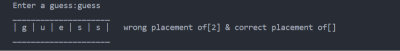
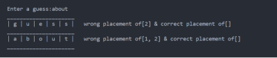
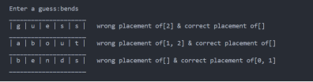

# Wordle-Python

This version is just a crude version of the end-result that is planned for the future. This runs currently on the terminal and exhibits the same working as that of any UI based version.

## Libraries Used
This Project makes use of the `Random` modue of python for selecting a random word out of the 3000+ 5 lettered English words supplied to the program as a word-bank and select that word as a word to be guessed by the user.

## Some Snaps of the Project

  
  
1st Try

  
  
2nd Try

  
  
3rd Try

  
  
4th Try

  
  
5th Try

